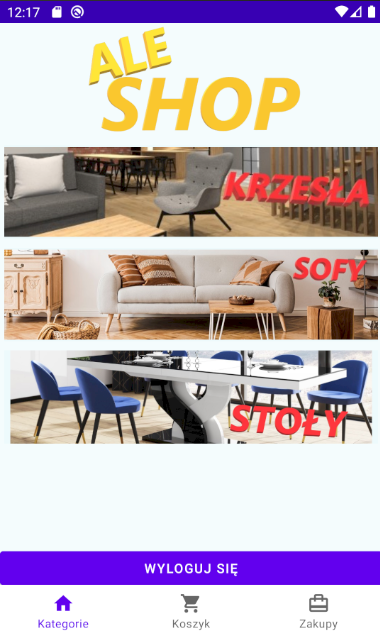
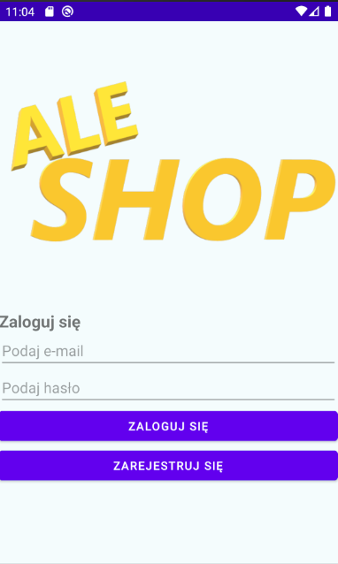
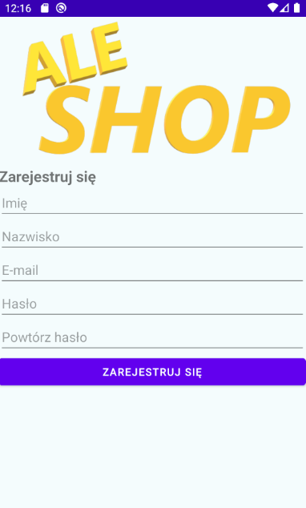
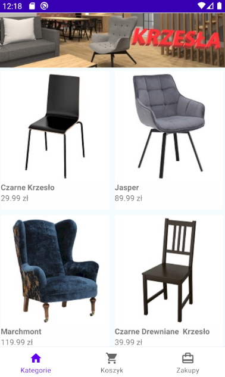
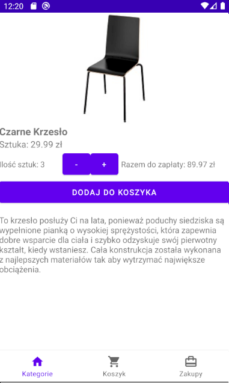
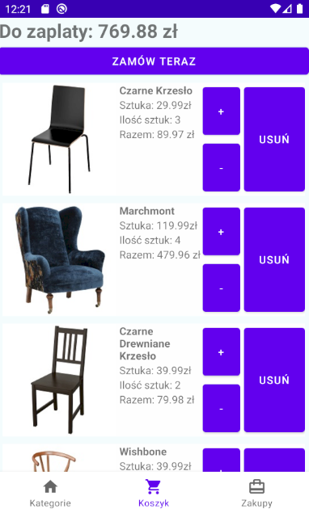

# AleShop
 
Application for the user of the online store. it is used to browse through the available products and to purchase them

# Table of Contens
* [General info](#general-info)
* [Technologies](#technologies)
* [Features](#features)

## General info

Log in to your account and then browse all available products. If you are interested in a product, add it to your cart. In the basket you can change the number of ordered items and remove the product. If the order is correct, order everything you have in the basket.

## Technologies
Kotlin
Firebase
MVVM
Gson
NoSQL
Glide
(work on fragments)

## Features

When installing the application for the first time, we have the option of logging in or registering if we do not have an account.

After logging in, the main window appears with categories to choose from and the option to log out.

After selecting the category we are interested in, we go to the products in it.

On the page of a specific product, we can read its description and add it to the cart.

After going to the cart tab, we can edit it, if the order is compatible, we can finish it.

In the order tab we can check the status of our order.

All pictures of the items and their names are for demonstration only
